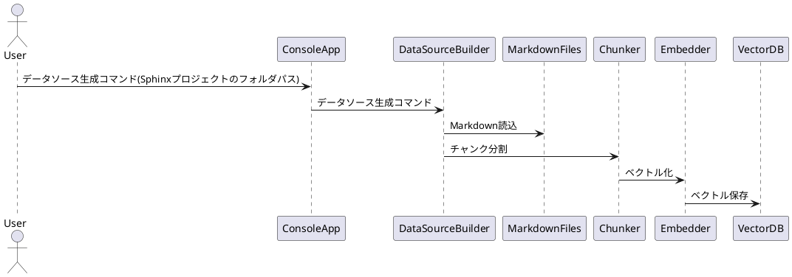
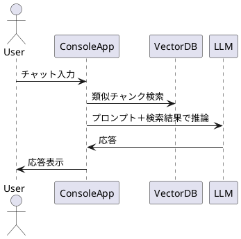

# localapp_llm_rag_documents 仕様書

## 概要

本ソフトウェアは、WindowsクライアントOS上で動作するローカル完結型のRAG（Retrieval-Augmented Generation）システムです。  
主にC# (.NET 9) を用いて開発し、SphinxプロジェクトのMarkdownドキュメント群をRAG用データソースとしてベクトルDB化し、  
ローカルLLMと連携したチャット型CUIを提供します。

---

## 機能要件

### 1. RAGデータソース生成

- Sphinxプロジェクト配下の複数Markdownファイルを入力として受け付ける
- Markdownファイルを適切にチャンク分割（セクション・段落・トークン数等で分割）
- 各チャンクをローカルで動作可能な軽量モデル（例: MiniLM, BGE等）＋Sewmantic Kernelでベクトル化
- ベクトルDB（ローカルファイルDB、例: SQLite, Faiss, Qdrant等）へ保存
- ベクトルDBはWindowsクライアントOSのローカルストレージ上に配置

### 2. LLMチャットCUI

- コンソールアプリ（CUI）として動作
- ユーザーからの入力を受け付け、LLMとテキストチャット
- 入力文に対し、ベクトルDBから類似チャンクを検索し、LLMへのプロンプトに付加（RAG動作）
- LLMはローカルで動作可能な軽量モデルを使用（例: llama.cpp, GGML, ONNX Runtime等）
- .NET GenericHostによるアプリケーションライフサイクル管理

---

## 非機能要件

- すべての処理はローカルPC上で完結（外部APIやクラウドサービスは利用しない）
- 主にC#で実装。他言語を使う場合はC++を優先
- Windows 10/11 クライアントOSで動作
- コマンドライン引数や設定ファイル（appsettings.json, UserSecrets等）による柔軟な設定

---

## 主な処理シーケンス

### 1. RAGデータソース生成

### 2. LLMチャットCUI

## 主な技術スタック

- .NET 9 / C#
- Microsoft.Extensions.Hosting (GenericHost)
- Sewmantic Kernel
- ローカルLLM（例: llama.cpp, GGML, ONNX Runtime等）
- ベクトルDB（例: SQLite, Faiss, Qdrant等）
- PlantUML（ドキュメント用）

---

## ソースコードディレクトリ構成

/LocalLlmRagApp
 |-- Program.cs
 |-- ConsoleHostedService.cs
 |-- AppConfig.cs
 |-- appsettings.json
 |-- /Data
 |-- /Models
 |-- /VectorDb
 |-- README.md

---

## 今後の拡張案

- GUI対応
- 複数LLMモデル切替
- ベクトルDBの種類追加
- チャンク分割・ベクトル化パラメータのカスタマイズ

---
